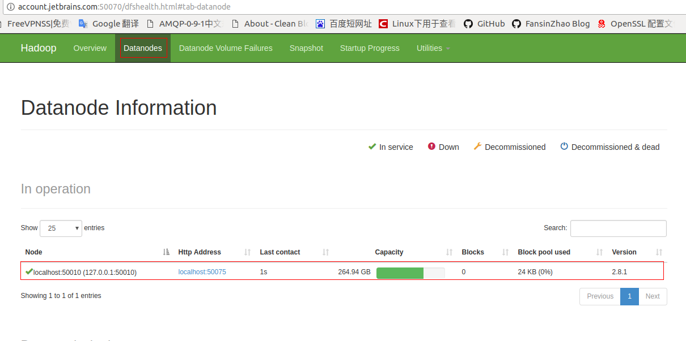
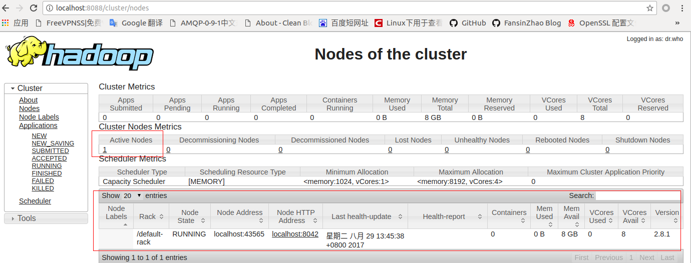

# hadoop 官方文档快速搭建

hadoop 2.8.1 , jdk8+

参考官方文档,具体步骤请查看官网,本文以实践为主.

下载完毕hadoop后,解压.

## 准备工作,不可跳过!

- 安装ssh,因为hadoop需要登录系统

       sudo apt-get install ssh
       sudo apt-get install pdsh

- 编辑 etc/hadoop/hadoop-env.sh,还是因为要登录系统,原先系统设置的环境变量无效.

    # set to the root of your Java installation
    export JAVA_HOME=/opt/jdk1.8.0_92

-  单机模式下

   etc/hadoop/core-site.xml:

        <configuration>
            <property>
                <name>fs.defaultFS</name>
                <value>hdfs://localhost:9900</value>
            </property>
        </configuration>

   etc/hadoop/hdfs-site.xml:

        <configuration>
            <property>
                <name>dfs.replication</name>
                <value>1</value>
            </property>
        </configuration>

## 单机示例(具体应该是三个实例,namenode,secondarynode,datanode)

    bin/hdfs namenode -format
    sbin/start-dfs.sh

关闭hadoop系统

    sbin/stop-dfs.sh

完成上面两步可以看到web,跟官方文档不太一样,查看`cat logs/hadoop-$(whoami)-namenode-$(hostname).log`

    Starting Web-server for hdfs at: http://account.jetbrains.com:50070

完成这一步就已经有了一个hadoop的最基本的环境.

下面创建MapReduce用户hadoop,并执行一个任务

    bin/hdfs dfs -mkdir /user
    bin/hdfs dfs -mkdir /user/hadoop

    bin/hdfs dfs -mkdir -p input
    bin/hdfs dfs -put etc/hadoop/*.xml input

    bin/hadoop jar share/hadoop/mapreduce/hadoop-mapreduce-examples-2.8.1.jar grep input output 'dfs[a-z.]+'

    bin/hdfs dfs -get output output
    cat output/*

## YARN 集群资源管理

将etc/hadoop/mapred-site.xml.template重命名为etc/hadoop/mapred-site.xml:

    <configuration>
        <property>
            <name>mapreduce.framework.name</name>
            <value>yarn</value>
        </property>
    </configuration>

etc/hadoop/yarn-site.xml:

    <configuration>
        <!-- Site specific YARN configuration properties -->
        <property>
            <name>yarn.nodemanager.aux-services</name>
            <value>mapreduce_shuffle</value>
        </property>
        <property>
            <name>yarn.nodemanager.env-whitelist</name>
            <value>JAVA_HOME,HADOOP_COMMON_HOME,HADOOP_HDFS_HOME,HADOOP_CONF_DIR,CLASSPATH_PREPEND_DISTCACHE,HADOOP_YARN_HOME,HADOOP_MAPRED_HOME</value>
        </property>
    </configuration>

启动脚本

    sbin/start-yarn.sh

查看日志确定一下web界面入口,`cat logs/yarn-$(whoami)-resourcemanager-$(hostname).log`

    Web app cluster started at 8088

yarn集群资源管理界面地址为 http://localhost:8088

*提示*
如果更换hadoop版本时,无法启动时,需要将`/tmp/`hadoop相关的文件删除
