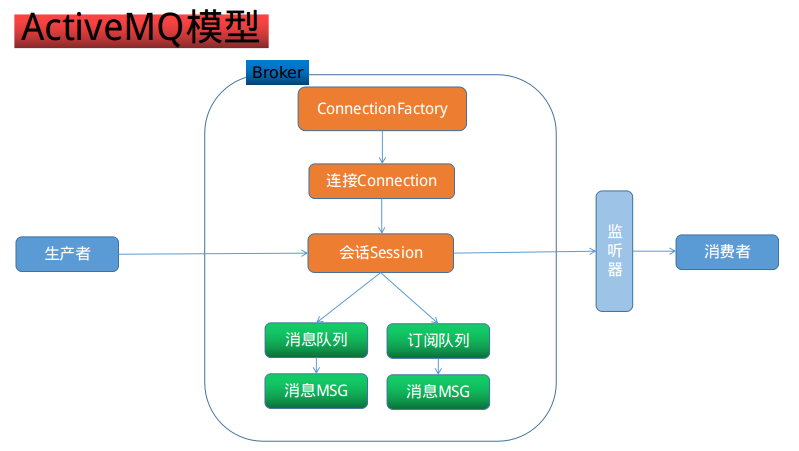
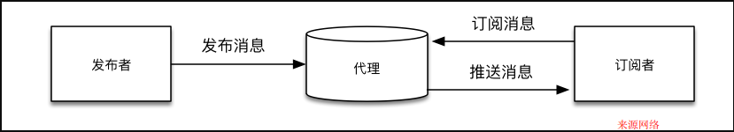

## 异步消息传输协议

目前流行的异步消息传输协议有jms,amqp,mqtt.

### JMS  Java Message Service

>一个消息服务的标准api或者说是规范，允许应用程序组件基于JavaEE平台创建、发送、接收和读取消息。它使分布式通信耦合度更低，消息服务更加可靠以及异步性。

这是sun公司的提出的一种传输协议,最典型的代表是activemq.
jms的模型比较简单,主要的优势也是借助java的优势.
模型中有三个主要的角色:生产者,消费者,jms broker.提供了2种基本的队列,点对点队列和主题订阅队列

以activemq为例,说明一下jms
>Apache ActiveMQ™是最流行和最强大的开源消息传递和集成模式服务器。--摘自官网

 

官网只提供了一些安装启动的基本教程,另外推荐了基本关于activemq的书籍,这点不如rabbitmq官方做的好.

### AMQP Advanced Message Queue Protocol

>一个提供统一消息服务的应用层标准高级消息队列协议,是应用层协议的一个开放标准,为面向消息的中间件设计。基于此协议的客户端与消息中间件可传递消息，并不受客户端/中间件不同产品，不同的开发语言等条件的限制。

可以看出,这个协议比jms"高级",这个协议不受限于平台或产品.是真正的消息中间件.
这个协议的典型代表就是rabbitmq. amqp的模型也是分为三层,生产者,消费者,exchange交换器.
amqp的客户端不会直接跟消息队列连接,而是跟exchange连接,这点跟jms有点不一样.amqp提供的基本队列比jms的丰富.提供了4种基本的消息队列
直接direct,扇出(跟jms中的topic一样)fanout,主题topic(不同于jms的topic),headers(使用header而不是routingkey).

以rabbitmq为例说明,

>RabbitMQ是部署最广泛的开源消息代理。

客户端通过nio连接到rabbitmq的exchange,exchange通过routingkey绑定到特定的queue,这里的queue就只有一种.
rabbitmq通过不同的exchange类型和绑定策略,从而实现多种不同用途的消息队列.

JMS 和 AMQP 区别点

性质:

jms 只是javaee中的api;amqp是一个跨平台跨语言的消息队列协议.

消息队列:

jms 仅支持点对点和订阅队列;amqp支持direct,fanout,topic,headers四种,涵盖了jms的2种队列.

消息类型:

jms 支持文本,map,对象,流,字节,消息等多种类型;amqp只支持字节(可以进行压缩).

实现产品:

activemq 和 rabbitmq 在消息中间件中比较成熟的产品,activemq在早起的金融尤其银行行业占着绝对的优势.
rabbitmq 凭借着灵活的模型,受各行业广泛的关注.

## MQTT Message Queueing Telemetry Transport

>IBM开发的一个即时通讯协议,该协议支持所有平台，几乎可以把所有联网物品和外部连接起来，被用来当做传感器和致动器（比如通过Twitter让房屋联网）的通信协议。

  
 
MQTT是一个基于客户端-服务器的消息发布/订阅传输协议。MQTT协议是轻量、简单、开放和易于实现的，这些特点使它适用范围非常广泛。

MQTT协议运行在TCP/IP或其他网络协议，提供有序、无损、双向连接。其特点包括：

1 使用的发布/订阅消息模式，它提供了一对多消息分发，以实现与应用程序的解耦。

2 对负载内容屏蔽的消息传输机制。

3 对传输消息有三种服务质量（QoS）：

* 最多一次，这一级别会发生消息丢失或重复，消息发布依赖于底层TCP/IP网络。即：<=1
* 至多一次，这一级别会确保消息到达，但消息可能会重复。即：>=1
* 只有一次，确保消息只有一次到达。即：＝1。在一些要求比较严格的计费系统中，可以使用此级别

4 数据传输和协议交换的最小化（协议头部只有2字节），以减少网络流量

5 通知机制，异常中断时通知传输双方

