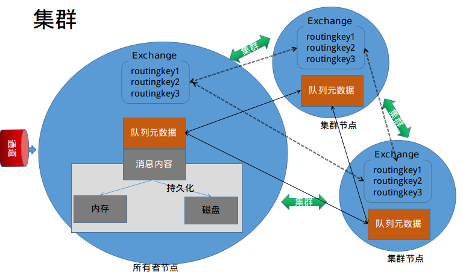
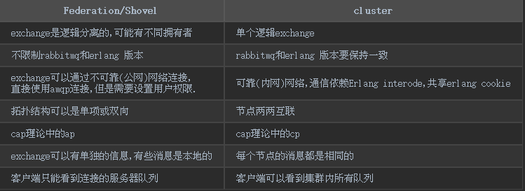

4 单机集群(跟多主机集群类似)

首先过一下rabbitmqctl提供的方法

    $sudo rabbitmqctl | egrep cluster
        join_cluster <clusternode> [--ram] 加入集群,cluster方法的升级,更加简单
        cluster_status 查看集群状态,app不启动,也是可以查看基本信息
        change_cluster_node_type disc | ram 更改节点类型
        forget_cluster_node [--offline] 移除集群
        rename_cluster_node oldnode1 newnode1 [oldnode2] [newnode2 ...] 重命名节点名称
        update_cluster_nodes clusternode 更新节点
        set_cluster_name name 设置集群名称

0 如果已经启动management插件,则先要关闭插件

    sudo rabbitmq-plugins disable rabbitmq_management

1 启动多个rabbitmq实例

    sudo RABBITMQ_NODE_PORT=5672 RABBITMQ_NODENAME=rabbit rabbitmq-server -detatched &
    sudo RABBITMQ_NODE_PORT=5673 RABBITMQ_NODENAME=rabbit_1 rabbitmq-server -detatched &
    sudo RABBITMQ_NODE_PORT=5674 RABBITMQ_NODENAME=rabbit_2 rabbitmq-server -detatched &

启动成功输出:

    ...
    completed with 0 plugins.
    completed with 0 plugins.
    completed with 0 plugins.
    ...

查看3个进程是否启动

    sudo netstat -pan |egrep "5672|5673|5674"

或者

    sudo rabbitmqctl -n rabbit@zhaofeng-pc status ;\
    sudo rabbitmqctl -n rabbit_1@zhaofeng-pc status ;\
    sudo rabbitmqctl -n rabbit_2@zhaofeng-pc status

2 加入集群
rabbitmq集群依赖的是erlang opt功能
rabbitmq的集群按节点持久化类型分为磁盘型和内存型,磁盘型节点必须有一个;按照性质可分为持有者和复制者.

现在将rabbit和rabbit_1,以磁盘的类型接入集群,加入集群时,可以将一个节点当做所有者节点,
其他节点依次接入到所有者集群.

接入集群的三个步骤,stop_app,join_cluster,start_app
首先查看集群状态

    sudo rabbitmqctl -n rabbit@zhaofeng-pc cluster_status ;\
    sudo rabbitmqctl -n rabbit_1@zhaofeng-pc cluster_status ;\
    sudo rabbitmqctl -n rabbit_2@zhaofeng-pc cluster_status

可以看到集群都是单节点的.现在把rabbit和rabbit_1加到同一个集群,上面已经看到了,每个节点
其实都是在集群中,只不过只有他们本身节点,那么,现在就只需要将rabbit_1加到rabbit即可.

    sudo rabbitmqctl -n rabbit_1@zhaofeng-pc stop_app
    sudo rabbitmqctl -n rabbit_1@zhaofeng-pc join_cluster rabbit@zhaofeng-pc
    sudo rabbitmqctl -n rabbit_1@zhaofeng-pc start_app

下面我们将rabbit_2以ram类型加入rabbit

    sudo rabbitmqctl -n rabbit_2@zhaofeng-pc stop_app
    sudo rabbitmqctl -n rabbit_2@zhaofeng-pc join_cluster --ram rabbit@zhaofeng-pc
    sudo rabbitmqctl -n rabbit_2@zhaofeng-pc start_app

操作到现在,你应该可以看到类似下面信息

    Cluster status of node 'rabbit_2@zhaofeng-pc'
    [{nodes,[{disc,['rabbit_1@zhaofeng-pc','rabbit@zhaofeng-pc']},
         {ram,['rabbit_2@zhaofeng-pc']}]},
    {running_nodes,['rabbit@zhaofeng-pc','rabbit_1@zhaofeng-pc',
                 'rabbit_2@zhaofeng-pc']},
    {cluster_name,<<"rabbit@zhaofeng-pc">>},
    {partitions,[]},
    {alarms,[{'rabbit@zhaofeng-pc',[]},
          {'rabbit_1@zhaofeng-pc',[]},
          {'rabbit_2@zhaofeng-pc',[]}]}]

3 集群客户端代码验证

现在开始进行代码验证,是否真正的集群了
测试代码跟官方hello world一样简单,不在这里粘贴.

[测试代码连接](http://dwz.cn/6mBrSJ)

集群中有3个服务器(本地),向任意一个服务中发送消息,均可以在其他服务器接收到消息,
证明集群有效

4 集群节点其他操作

为了提高性能,现在我们改变一下rabbit_1的类型为ram

    sudo rabbitmqctl -n rabbit_1@zhaofeng-pc stop_app
    sudo rabbitmqctl -n rabbit_1@zhaofeng-pc change_cluster_node_type ram
    sudo rabbitmqctl -n rabbit_1@zhaofeng-pc start_app

现在你可以看到rabbit_1已经变成了ram类型的节点了.
如果发现节点有问题,或者其他原因,想要下线集群,可以通过reset/force_reset或forget_cluster_node,
其中,reset:重置本身的节点,必须等待stop_app;
forget_cluster_node:集群中在线的节点,将已下线的节点移除集群,用于删除故障节点

    $sudo rabbitmqctl -n rabbit_2@zhaofeng-pc reset
    Resetting node 'rabbit_2@zhaofeng-pc'
    Error:  Mnesia is still running on node 'rabbit_2@zhaofeng-pc'.
            Please stop the node with rabbitmqctl stop_app first.

    sudo rabbitmqctl -n rabbit_2@zhaofeng-pc stop_app
    sudo rabbitmqctl -n rabbit_2@zhaofeng-pc reset
    sudo rabbitmqctl -n rabbit_2@zhaofeng-pc start_app

使用 forget_cluster_node,其中--offline,用于删除最后一个节点

    sudo rabbitmqctl -n rabbit_2@zhaofeng-pc stop_app
    sudo rabbitmqctl -n rabbit@zhaofeng-pc forget_cluster_node  rabbit_2@zhaofeng-pc

处理完了,重新上线

    sudo rabbitmqctl -n rabbit_2@zhaofeng-pc join_cluster rabbit@zhaofeng-pc
    sudo rabbitmqctl -n rabbit_2@zhaofeng-pc start_app

其他的小功能:
集群任意节点重命名集群名称,默认集群名称为收割加入节点的节点名称
默认是:

    $sudo rabbitmqctl -n rabbit_2@zhaofeng-pc cluster_status
    {cluster_name,<<"rabbit@zhaofeng-pc">>},
    $sudo rabbitmqctl -n rabbit_2@zhaofeng-pc set_cluster_name rabbit-cluster
    Setting cluster name to rabbit-cluster
    $sudo rabbitmqctl -n rabbit_2@zhaofeng-pc cluster_status
    ...
    {cluster_name,<<"rabbit-cluster">>},
    ...

5 多机器(真机)集群

第一点 注意erlang-cookie要保持一致.
cookie 存放的位置在:

    sudo cat ~/.erlang.cookie
    sudo cat /var/lib/rabbitmq/.erlang.cookie

第二点 rabbitmq的版本要一致

我们可以使用docker 验证一下

启动3个容器

    docker run --rm -d --hostname my-rabbit --name my-rabbit -e RABBITMQ_ERLANG_COOKIE='secret cookie here' rabbitmq
    docker run --rm -d --hostname my-rabbit-1 --name my-rabbit-1 -e RABBITMQ_ERLANG_COOKIE='secret cookie here' rabbitmq
    docker run --rm -d --hostname my-rabbit-2 --name my-rabbit-2 -e RABBITMQ_ERLANG_COOKIE='secret cookie here' rabbitmq

查看第一个IP,其后两个ip依次累加

    $docker inspect my-rabbit | grep IPAddress
                "SecondaryIPAddresses": null,
                "IPAddress": "172.17.0.3",
                        "IPAddress": "172.17.0.3",

现在已经知道三个机器地址了.用到本文讲得,依次为三个服务器添加远程用户

    $docker  exec -it  my-rabbit bash

    root@my-rabbit:/# rabbitmqctl add_user admin admin
    Creating user "admin"
    root@my-rabbit:/# rabbitmqctl authenticate_user admin admin
    Authenticating user "admin"
    Success
    root@my-rabbit:/# rabbitmqctl set_permissions -p / admin '.*' '.*' '.*'
    Setting permissions for user "admin" in vhost "/"
    root@my-rabbit:/# rabbitmqctl list_user_permissions admin
    Listing permissions for user "admin"
    /	.*	.*	.*

rabbitmq依赖的是主机名,所以还要在`/etc/hosts`添加其他节点主机信息,
事实上,只要保证非所有者节点有所有者节点即可

    172.17.0.3 my-rabbit

    root@my-rabbit:/# echo -e "172.17.0.3 my-rabbit\n172.17.0.4 my-rabbit-1\n172.17.0.5 my-rabbit-2" >> /etc/hosts

或者是,使用--link,直接使用其他容器

添加完了这些,剩下的就是stop_app,join_cluster,start_app了,下面举例一个

    root@my-rabbit-1:/# rabbitmqctl stop_app
    Stopping rabbit application on node 'rabbit@my-rabbit-1'
    root@my-rabbit-1:/# rabbitmqctl join_cluster --ram rabbit@my-rabbit
    Clustering node 'rabbit@my-rabbit-1' with 'rabbit@my-rabbit'
    root@my-rabbit-1:/# rabbitmqctl start_app
    Starting node 'rabbit@my-rabbit-1'
    root@my-rabbit-1:/# rabbitmqctl cluster_status
    Cluster status of node 'rabbit@my-rabbit-1'
    [{nodes,[{disc,['rabbit@my-rabbit-2','rabbit@my-rabbit']},
             {ram,['rabbit@my-rabbit-1']}]},
     {running_nodes,['rabbit@my-rabbit','rabbit@my-rabbit-2',
                     'rabbit@my-rabbit-1']},
     {cluster_name,<<"rabbit@my-rabbit">>},
     {partitions,[]},
     {alarms,[{'rabbit@my-rabbit',[]},
              {'rabbit@my-rabbit-2',[]},
              {'rabbit@my-rabbit-1',[]}]}]

现在我们已经实现了真机(测试/生产环境)条件下的集群了.
我使用docker,创建了简单的集群镜像,方便测试使用

[Docker Hub镜像地址](https://hub.docker.com/r/fansin/rabbitmq-cluster/)

代码测试正常! [测试代码连接](http://dwz.cn/6mBrSJ)

6 其他的分布式方式

官方还提供了一种Federation / Shovel的方式,这是一种转发的机制,消息可以发我其他的服务节点.

这两者的区别

分布式原理:
Federation / Shovel: exchange 逻辑上是分离的,可能有不同的拥有者

Federation/Shovel                  | cluster
-----------------                  | ---
exchange是逻辑分离的,可能有不同拥有者  |单个逻辑exchange
不限制rabbitmq和erlang 版本          | rabbitmq和erlang 版本要保持一致
exchange可以通过不可靠(公网)网络连接, 直接使用amqp连接,但是需要设置用户权限.|可靠(内网)网络,通信依赖Erlang interode,共享erlang cookie
拓扑结构可以是单项或双向               |节点两两互联
cap理论中的ap                        |cap理论中的cp
exchange可以有单独的信息,有些消息是本地的|每个节点的消息都是相同的
客户端只能看到连接的服务器队列           |客户端可以看到集群内所有队列

