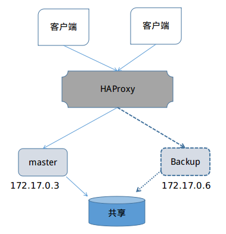

haproxy和keep-alive大家即使没有用也应该都听过吧.网上介绍的比较多,官网文档也比较全.
那我们直接开始演示

# 基本高可用

1 首先安装haproxy,安装的方式比较多,使用自己喜欢的就行,我直接使用apt仓库的.

    sudo apt install haproxy

等待安装完成就行了.默认的配置文件在/etc/haproxy/haproxy.cfg

2 编辑配置文件,可以通过-f启动自定义的配置文件.这个是按照"rabbitmq实战"上配置的模板
保存为haproxy.cfg.其中主要的是`server rabbit 172.17.0.3:5672 check inter 5000 rise 2 fall 3`的ip配置.
我使用docker启动了有三个节点的rabbitmq集群.如果不会可以参考我相关文章["RabbitMQ 集群使用"](https://fansinzhao.github.io/page/linux-rabbitmq-cluster.html)

    global
        log 127.0.0.1 local0 info
        maxconn 4096
        stats socket /tmp/haproxy.socket uid haproxy mode 770 level admin
        daemon
    defaults
        log global
        mode tcp
        option tcplog
        option dontlognull
        retries 3
        option redispatch
        maxconn 2000
        timeout connect 5s
        timeout client 120s
        timeout server 120s
    listen rabbitmq_cluster
        bind 127.0.0.1:5670
        mode tcp
        balance roundrobin
        server rabbit 172.17.0.3:5672 check inter 5000 rise 2 fall 3
        server rabbit_1 172.17.0.4:5672 check inter 5000 rise 2 fall 3
        server rabbit_2 172.17.0.5:5672 check inter 5000 rise 2 fall 3
    listen private_monitoring
        bind :8100
        mode http
        option httplog
        stats enable
        stats uri /stats
        stats refresh 5s
3 启动haproxy.

    sudo haproxy -f HAProxy-rabbitmq.cfg

访问ui界面 http://localhost:8100/stats .可以看到界面,即启动成功!

上面我们已经有了一个简单的rabbitmq的haproxy,下面我们要验证一下是否可用.
我们现在是看不到haproxy的日志的,我们使用rsyslog日志系统来记录haproxy日志.
创建目录,并赋予写权限.

    mkdir /var/log/haproxy
    chmod a+w /var/log/haproxy

rsyslog默认是已安装的,如果没有自行安装一下. `sudo apt install rsyslog`
打开rsyslog默认配置文件,开始udp功能

    module(load="imudp")
    input(type="imudp" port="514")
并在下面添加haproxy日志发往地址local0,监听所有日志.

    local0.* /var/log/haproxy/haproxy.log

重启rsyslog,和haproxy

    sudo systemctl stop rsyslogd
    sudo systemctl start rsyslogd
    sudo pgrep -a haproxy
    sudo kill -9 pid
    sudo haproxy -f HAProxy-rabbitmq.cfg

现在我们就可以看到日志了

    tailf /var/log/haproxy/haproxy.log

简单看一条消息

    2017-08-11T10:07:03+08:00 localhost haproxy[12948]: 127.0.0.1:53708 [11/Aug/2017:10:07:03.042] rabbitmq_cluster rabbitmq_cluster/rabbit_2 1/0/299 572 SD 2/2/2/0/0 0/0

发送方: `127.0.0.1:53708` 接收方: `rabbitmq_cluster rabbitmq_cluster/rabbit_2`

现在我们做了一个HA,对于HA之外的人来说,只有一个地址,当访问的时候,会随机访问其中一个rabbitmq server.
通过界面,我们可以在Sessions栏目看到cur(rent)连接,cur表示连接的数量,例如现在是my-rabbit-cluster
节点,现在我们关闭这个服务stop_app,

我们已经做了集群,但是我们的集群是有弊端的,那就是没有做到Queue和exchange同步.需要在任意节点开启
镜像复制功能

    rabbitmqctl set_policy -p '/' ha-all '.+' '{"ha-mode": "all"}'

完成上面的工作后,我们终于可以通过代码验证高可用集群了.
首先我们运行我们的代码,发送1000条记录,消费者每1s接收一条.消息正常接收中.
我们在界面 http://localhost:8100/stats 上看到session部分有1个cur,那就是现在连接
的服务器,比如,现在连接的rabbitmq-cluster节点,可以通过management界面 http://172.17.0.3:15672/#/
的overview看到这个节点连接1个connection.

第一步 现在我们stop_app或者management界面reset当前连接的,过一会下线后,活跃连接到另外一台机器.

第二步 现在我们看到连接跳跃到另外一台,然而有一点必须注意,客户端现在不再"接收消息",但是,真的是不再接收消息么?
现在我们通过management界面向队列发送一条消息,客户端真实的收到消息了!,可见,目前的高可用
并不能保证一致性,只是保证了系统可用.

第三步 我们重启之前关闭的节点,现在我们通过management界面强制关闭连接,连接又跳回第一次节点(假设就2个节点)

看过官方文档的人都知道,集群时,队列不能持久化,考虑到性能和复杂的问题,官方并不支持.
如果设置队列为持久化,则会报下面的错误

`channel error; protocol method: #method<channel.close>(reply-code=406, reply-text=PRECONDITION_FAILED - inequivalent arg 'durable' for queue 'queue.haproxy' in vhost '/': received 'true' but current is 'false', class-id=50, method-id=10)`

[代码演示请点击](http://dwz.cn/6nxkVo)

# 主备高可用

考虑到这点,还有一种主/备集群模式,原理是使用haproxy的backup节点,主节点和backup节点只能
有一个节点可以使用,消息放在共享存储上,从而避免了节点之间的消息复制.关于共享内存,官方给出了pacemaker的案例.
实现主备比上面的变化就是定义server时多了一个backup属性.
HAProxy-rabbitmq-warren.cfg 配置文件

    global
        # 0 系统不可用 1 必须马上采取行动的事件 2 关键的事件 3 错误事件 4 警告事件 5 普通但重要的事件 6 有用的信息 7 调试信息
        log 127.0.0.1 local7 info
        maxconn 4096
        stats socket /tmp/haproxy_warren.socket uid haproxy mode 770 level admin
        daemon
    defaults
        log global
        mode tcp
        option tcplog
        option dontlognull
        retries 3
        option redispatch
        maxconn 2000
        timeout connect 5s
        timeout client 120s
        timeout server 120s
    listen rabbitmq_cluster
        bind 127.0.0.1:5680
        mode tcp
        balance roundrobin
        server rabbit 172.17.0.3:5672 check inter 5000 rise 2 fall 3
        server rabbit_backup 172.17.0.6:5672 backup check inter 5000 rise 2 fall 3
    listen private_monitoring
        bind :8101
        mode http
        option httplog
        stats enable
        stats uri /stats
        stats refresh 5s

其他步骤同上面,唯一不同在于http://localhost:8101/stats 界面显示的备份节点是蓝色的.
代码测试也跟上面的一样,只不过每次只有主或备启动.相对于上面的有几个优势:rabbitmq的版本可以不必保持一致,
但应该保持兼容.

[代码演示请点击](http://dwz.cn/6nxERM)

