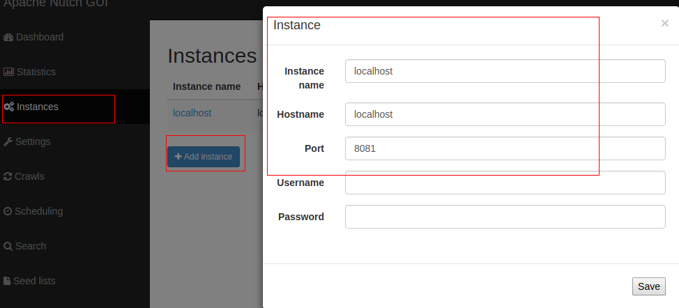
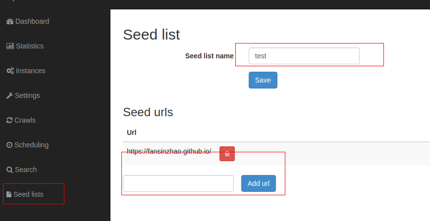
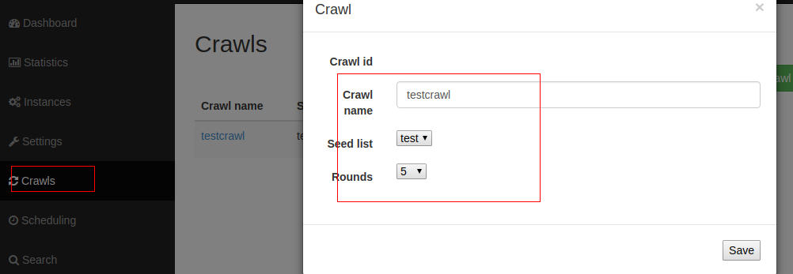

# nutch 快速搭建(其实并不快/(ㄒoㄒ)/~~)

由于个人的一些事,我需要搭建一个爬虫,当我去比较爬虫框架时,发现"多如牛毛",各种语言的都有.
经过一段时间的考虑,我选择自己能够快速上手并且比较用的比较多的.我想要掘取搜索引擎查询的内容,
最终的选择是nutch和heritrix,但是heritrix最新的更新也是2014年的,根据招聘网站上的职位
要求(毕竟可能在工作用到),大部分集中在python和这两款.综上,选择了nutch作为我的最终选择.

# "复杂的"编译过程

*提示:*

如果想快速搭建nutch环境,必须要遵循官网的建议,不能一味使用最新的软件(不多说了,都是泪/(ㄒoㄒ)/~~).

## 1 Apache Gora 0.7 [下载](http://www.apache.org/dyn/closer.cgi/gora/0.7/gora/0.7/gora-0.6.1-src.tar.gz)

它是专门为大数据设计的开源orm框架.支持列(hbase)存储,KV值存储(Cassandra),文档存储(mongdb),
关系型数据库(mysql),通过hadoop的MapReduce来分析数据.

如果有折腾的心,可以尝试使用gora编译最新版本的hbase和hadoop.
我尝试了一下,失败了!有兴趣的可以尝试,我说一下我遇到的坑
1. 官网上只发现了0.7的版本,编译jar中,缺失gora-shims-distribution-0.6.1.jar
2. gora的源码中GoraMapper.initMapperJob() 接口发生变化,需要修改gora或者nutch源码
3. 修复了2中的api,后面还有更多的erro...

## 2 Apache Nutch 2.3.1 [下载](http://www.apache.org/dyn/closer.lua/nutch/2.3.1/apache-nutch-2.3.1-src.tar.gz)

解压后,进入安装目录:

#### 1 修改站点文件`conf/nutch-site.xml`添加一下配置

    <configuration>
        <property>
         <name>http.agent.name</name>
         <value>My Nutch Spider</value>
        </property>

        <property>
            <name>storage.data.store.class</name>
            <value>org.apache.gora.hbase.store.HBaseStore</value>
            <description>Default class for storing data</description>
        </property>
    </configuration>

#### 2 修改配置文件`conf/gora.properties`,"HBaseStore properties"添加

    #########################
    # HBaseStore properties #
    #########################
    gora.datastore.default=org.apache.gora.hbase.store.HBaseStore

#### 3 修改配置文件`ivy/ivy.xml`,使用hbase 作为gora 后台数据库

    <dependency org="org.apache.gora" name="gora-hbase" rev="0.6.1" conf="*->default" />
    <dependency org="org.apache.hbase" name="hbase-common" rev="0.98.8-hadoop2" conf="*->default" />

#### 4 开始编译,如果你不想傻傻等待屏幕静止10+min,记得加上-d,开启debug模式

    ant clean
    ant -d runtime

等待编译成功后,在安装目录下出现`runtime/`文件夹,大概如下,限于冗余篇幅,只罗列2层目录

    tree runtime/ -d -L 2
    runtime/
    ├── deploy
    │   └── bin
    └── local
        ├── bin
        ├── conf
        ├── lib
        ├── plugins
        └── test

    8 directories

#### 5 简单测试一下我们生成的脚本是否可用

    zhaofeng@zhaofeng-pc:/opt/apache-nutch-2.3.1/runtime/local$bin/nutch
    Usage: nutch COMMAND
    where COMMAND is one of:
     inject		inject new urls into the database
     hostinject     creates or updates an existing host table from a text file
     generate 	generate new batches to fetch from crawl db
     fetch 		fetch URLs marked during generate
     parse 		parse URLs marked during fetch
     updatedb 	update web table after parsing
     updatehostdb   update host table after parsing
     readdb 	read/dump records from page database
     readhostdb     display entries from the hostDB
     index          run the plugin-based indexer on parsed batches
     elasticindex   run the elasticsearch indexer - DEPRECATED use the index command instead
     solrindex 	run the solr indexer on parsed batches - DEPRECATED use the index command instead
     solrdedup 	remove duplicates from solr
     solrclean      remove HTTP 301 and 404 documents from solr - DEPRECATED use the clean command instead
     clean          remove HTTP 301 and 404 documents and duplicates from indexing backends configured via plugins
     parsechecker   check the parser for a given url
     indexchecker   check the indexing filters for a given url
     plugin 	load a plugin and run one of its classes main()
     nutchserver    run a (local) Nutch server on a user defined port
     webapp         run a local Nutch web application
     junit         	runs the given JUnit test
     or
     CLASSNAME 	run the class named CLASSNAME
    Most commands print help when invoked w/o parameters.

## 3 hadoop 2.8.1 [下载](http://www.apache.org/dyn/closer.cgi/hadoop/common/hadoop-2.8.1/hadoop-2.8.1.tar.gz) 和 hbase 0.98.8-hadoop2 [下载](http://archive.apache.org/dist/hbase/hbase-0.98.8/)

### 3.1 [快速安装hadoop]()

解压并进入安装目录:

#### 3.1.1 安装ssh

hadoop 是一种分布式文件系统,即使是本地也是需要登录的,所以ssh是必要的.

       sudo apt-get install ssh
       sudo apt-get install pdsh

####3.1.2 设置JAVA_HOME

编辑 etc/hadoop/hadoop-env.sh,还是因为要登录系统,原先系统设置的环境变量无效.

    # set to the root of your Java installation
    export JAVA_HOME=/opt/jdk1.8.0_92

#### 3.1.3 单机模式-设置端口和复制模式

向两个站点文件添加配置,默认为空配置

       etc/hadoop/core-site.xml:

            <configuration>
                <property>
                    <name>fs.defaultFS</name>
                    <value>hdfs://localhost:9900</value>
                </property>
            </configuration>

       etc/hadoop/hdfs-site.xml:

            <configuration>
                <property>
                    <name>dfs.replication</name>
                    <value>1</value>
                </property>
            </configuration>

#### 3.1.4 启动hadoop并验证

    bin/hdfs namenode -format
    sbin/start-dfs.sh

正常启动会有3个线程,namenode,secondarynode,datanode

    zhaofeng@zhaofeng-pc:~$ jps -l | grep hdfs
    14375 org.apache.hadoop.hdfs.server.namenode.NameNode
    14793 org.apache.hadoop.hdfs.server.namenode.SecondaryNameNode
    14538 org.apache.hadoop.hdfs.server.datanode.DataNode

,跟官方文档不太一样,查看`cat logs/hadoop-$(whoami)-namenode-$(hostname).log`

    Starting Web-server for hdfs at: http://account.jetbrains.com:50070

#### 3.1.5 [YARN 集群资源管理]()

#### 3.1.6 停止和销毁

    sbin/stop-dfs.sh
    rm -r /tmp/hadoop*

### 3.2 [快速安装hbase]()

    注意:
    hbase < 1.0版本web UI 地址是 http://localhost:60010

解压并进入安装目录

#### 3.2.1 启动和停止hbase

    bin/start-hbase.sh
    bin/stop-hbase.sh
    rm -r /tmp/hbase*

#### 3.2.2 集成hadoop

按照上面设置创建了hadoop.暴露的端口是9900
修改配置文件`conf/hbase-site.xml`(默认为空),添加以下内容

    <configuration>
        <property>
          <name>hbase.cluster.distributed</name>
          <value>true</value>
        </property>

        <property>
          <name>hbase.rootdir</name>
          <value>hdfs://localhost:9900/hbase</value>
        </property>
    </configuration>

设置jdk版本,修改启动脚本bin/start-hbase.sh

    export JAVA_HOME=/opt/jdk1.8.0_92

修改完配置后,重新启动hbase

    bin/start-hbase.sh

这时会比单机多一个进程,HRegionServer-用于管理数据的RegionServer

    zhaofeng@zhaofeng-pc:/opt/hbase-1.2.6$ jps -l | grep hbase
    1618 org.apache.hadoop.hbase.regionserver.HRegionServer
    1448 org.apache.hadoop.hbase.zookeeper.HQuorumPeer
    1515 org.apache.hadoop.hbase.master.HMaster

简单测试hbase
连接控制台

   bin/hbase shell
   hbase(main):001:0>

查看hadoop是否正常加入,进入hadoop安装目录

    zhaofeng@zhaofeng-pc:/opt/hadoop-2.8.1$ bin/hadoop fs -ls /hbase
    Found 9 items
    drwxr-xr-x   - zhaofeng supergroup          0 2017-08-29 16:47 /hbase/.tmp
    drwxr-xr-x   - zhaofeng supergroup          0 2017-08-29 16:47 /hbase/MasterProcWALs
    drwxr-xr-x   - zhaofeng supergroup          0 2017-08-29 16:47 /hbase/WALs
    drwxr-xr-x   - zhaofeng supergroup          0 2017-08-29 15:51 /hbase/archive
    drwxr-xr-x   - zhaofeng supergroup          0 2017-08-29 15:37 /hbase/corrupt
    drwxr-xr-x   - zhaofeng supergroup          0 2017-08-29 14:25 /hbase/data
    -rw-r--r--   3 zhaofeng supergroup         42 2017-08-29 14:25 /hbase/hbase.id
    -rw-r--r--   3 zhaofeng supergroup          7 2017-08-29 14:25 /hbase/hbase.version
    drwxr-xr-x   - zhaofeng supergroup          0 2017-08-29 16:47 /hbase/oldWALs

### 3.3 再次测试nutch

在`runtime/`创建一个文件`urls/seed.txt`,并在里面填写需要爬取文件内容.

    http://nutch.apache.org/

注册urls

    bin/nutch inject urls
    bin/nutch readdb -url http://nutch.apache.org/ -text

## 4 Apache Solr

为了方便对数据进行分析,使用solr来分析获取的数据

### 4.1 集成nutch和solr
下载并进入进入solr 6.6.0 安装目录

#### 4.1.1 创建一个nutch 配置文件

    cp -r server/solr/configsets/basic_configs server/solr/configsets/nutch

#### 4.1.2 把nutch安装目录中的`conf/schema.xml`复制到solr下的`server/solr/configsets/nutch/conf`
并注释掉不支持参数

    <!--
    <defaultSearchField>text</defaultSearchField>
    <solrQueryParser defaultOperator="OR"/>
    -->

全文删除参数`enablePositionIncrements="true"`

#### 4.1.3 删掉文件 `server/solr/configsets/nutch/conf/managed-schema`

    rm server/solr/configsets/nutch/conf/managed-schema

#### 4.1.4 注释掉文件`server/solr/configsets/nutch/conf/solrconfig.xml`

    <!--
    <processor class="solr.AddSchemaFieldsUpdateProcessorFactory">
      <str name="defaultFieldType">strings</str>
      <lst name="typeMapping">
        <str name="valueClass">java.lang.Boolean</str>
        <str name="fieldType">booleans</str>
      </lst>
      <lst name="typeMapping">
        <str name="valueClass">java.util.Date</str>
        <str name="fieldType">tdates</str>
      </lst>
      <lst name="typeMapping">
        <str name="valueClass">java.lang.Long</str>
        <str name="valueClass">java.lang.Integer</str>
        <str name="fieldType">tlongs</str>
      </lst>
      <lst name="typeMapping">
        <str name="valueClass">java.lang.Number</str>
        <str name="fieldType">tdoubles</str>
      </lst>
    </processor>
    -->

回到安装目录启动solr,并创建nutch

    bin/solr start
    bin/solr create_core  -c nutch -d server/solr/configsets/nutch/conf

查看页面 http://localhost:8983/solr/#/nutch

不要忘记开启nutch的solr插件功能,修改nutch的`runtime/conf/nutch-site.xml`

    <property>
      <name>plugin.includes</name>
      <value>protocol-http|urlfilter-regex|parse-(html|tika)|index-(basic|anchor)|indexer-solr|scoring-opic|urlnormalizer-(pass|regex|basic)</value>
    </property>

     <property>
       <name>plugin.folders</name>
       <value>plugins</value>
     </property>

## 4.2 使用nutch craw命令爬取数据

在`runtime/`创建一个文件`urls/seed.txt`,并在里面填写需要爬取文件内容.

    http://nutch.apache.org/

爬取数据格式

    crawl 格式:

        Usage: crawl <seedDir> <crawlID> [<solrUrl>] <numberOfRounds>

开始爬取数据

    bin/crawl urls test http://localhost:8983/solr/nutch 1

如果有错误,查看日志,定位问题.
正常情况下,就可以在solr界面看到我们这次爬取的数据.

简析crawl过程,根据日志可以看到几个部分

1. 注入种子urls

    Injecting seed URLs
    /opt/apache-nutch-2.3.1/runtime/local/bin/nutch inject urls -crawlId test

2. 产生mapreduce任务

    Generating batchId
    Generating a new fetchlist
    /opt/apache-nutch-2.3.1/runtime/local/bin/nutch generate -D mapred.reduce.tasks=2 -D mapred.child.java.opts=-Xmx1000m -D mapred.reduce.tasks.speculative.execution=false -D mapred.map.tasks.speculative.execution=false -D mapred.compress.map.output=true -topN 50000 -noNorm -noFilter -adddays 0 -crawlId test -batchId 1504146902-24203
3. 抽取任务

    Fetching :
    /opt/apache-nutch-2.3.1/runtime/local/bin/nutch fetch -D mapred.reduce.tasks=2 -D mapred.child.java.opts=-Xmx1000m -D mapred.reduce.tasks.speculative.execution=false -D mapred.map.tasks.speculative.execution=false -D mapred.compress.map.output=true -D fetcher.timelimit.mins=180 1504146902-24203 -crawlId test -threads 50
    ...
    Using queue mode : byHost
    Fetcher: threads: 50
    QueueFeeder finished: total 1 records. Hit by time limit :0

4. 解析数据

    Parsing :
    /opt/apache-nutch-2.3.1/runtime/local/bin/nutch parse -D mapred.reduce.tasks=2 -D mapred.child.java.opts=-Xmx1000m -D mapred.reduce.tasks.speculative.execution=false -D mapred.map.tasks.speculative.execution=false -D mapred.compress.map.output=true -D mapred.skip.attempts.to.start.skipping=2 -D mapred.skip.map.max.skip.records=1 1504146902-24203 -crawlId test

5. 写库

    CrawlDB update for test
    /opt/apache-nutch-2.3.1/runtime/local/bin/nutch updatedb -D mapred.reduce.tasks=2 -D mapred.child.java.opts=-Xmx1000m -D mapred.reduce.tasks.speculative.execution=false -D mapred.map.tasks.speculative.execution=false -D mapred.compress.map.output=true 1504146902-24203 -crawlId test

6. 创建solr索引

    Indexing test on SOLR index -> http://localhost:8983/solr/nutch
    /opt/apache-nutch-2.3.1/runtime/local/bin/nutch index -D mapred.reduce.tasks=2 -D mapred.child.java.opts=-Xmx1000m -D mapred.reduce.tasks.speculative.execution=false -D mapred.map.tasks.speculative.execution=false -D mapred.compress.map.output=true -D solr.server.url=http://localhost:8983/solr/nutch -all -crawlId test
    IndexingJob: starting
    Active IndexWriters :
    SOLRIndexWriter
    	solr.server.url : URL of the SOLR instance (mandatory)
    	solr.commit.size : buffer size when sending to SOLR (default 1000)
    	solr.mapping.file : name of the mapping file for fields (default solrindex-mapping.xml)
    	solr.auth : use authentication (default false)
    	solr.auth.username : username for authentication
    	solr.auth.password : password for authentication

    IndexingJob: done.

7. solr去重

    SOLR dedup -> http://localhost:8983/solr/nutch
    /opt/apache-nutch-2.3.1/runtime/local/bin/nutch solrdedup -D mapred.reduce.tasks=2 -D mapred.child.java.opts=-Xmx1000m -D mapred.reduce.tasks.speculative.execution=false -D mapred.map.tasks.speculative.execution=false -D mapred.compress.map.output=true http://localhost:8983/solr/nutch

[不推荐]

参考 nutch api,发现了 nutchserver 和 webapp 进行爬数据

    bin/nutch nutchserver
    bin/nutch webapp

`但是仍然感觉是个半成品,还没有做好`

server 默认端口为8081,webapp 默认地址: http://localhost:8080
打开web UI,新建一个instance,端口已启动的一致.

新建实例

新建seed urls

爬取seed

