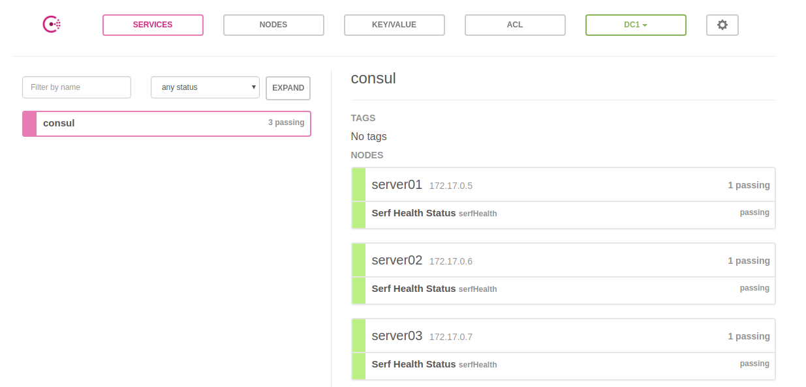
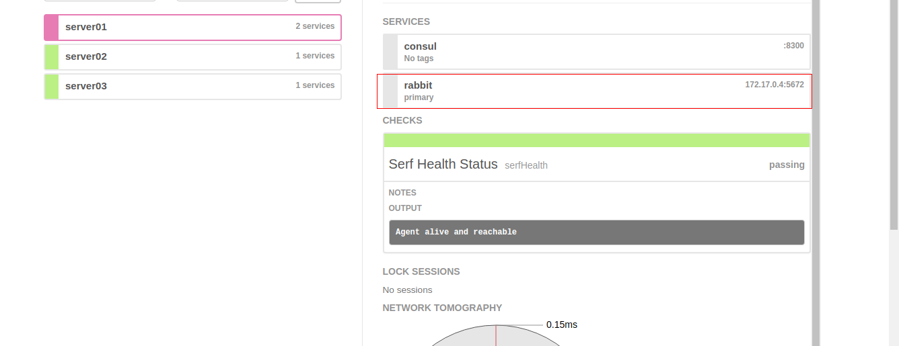

## 0 为什么要学习consul(本小节内容摘自网络)

应用场景:

- docker 实例的注册与配置共享
- coreos 实例的注册与配置共享
- vitess 集群
- SaaS 应用的配置共享
- 与 confd 服务集成，动态生成 nginx 和 haproxy 配置文件

软件特点:

1. 服务发现：consul客户端可以提供service，例如api或mysql,其他客户端可以使用consul来发现service的提供者.通过使用DNS或HTTP,应用程序可以轻松找到所需要的service.
2. 健康检查：consul客户端可以对任何远程server(能够响应200的)节点或者本地节点(内存使用率低于90%)进行多次健康检查.运维人员可以用来监视群集运行状况,并且通过服务发现,引流问题节点.
3. KV存储：应用程序可以使用consul的key/value存储来做很多事情,比如动态配置,功能标记,协调,领导选举等.简单的HTTP API使其易于使用。
4. 多数据中心：consul支持多个数据中心开箱即用.这意味着consul的用户不必担心建立更多层次的抽象来扩展到多个分区.

与其他软件比较:

- 使用 Raft 算法来保证一致性, 比复杂的 Paxos 算法更直接. 相比较而言, zookeeper 采用的是 Paxos, 而 etcd 使用的则是 Raft.
- 支持多数据中心，内外网的服务采用不同的端口进行监听。 多数据中心集群可以避免单数据中心的单点故障,而其部署则需要考虑网络延迟, 分片等情况等. zookeeper 和 etcd 均不提供多数据中心功能的支持.
- 支持健康检查. etcd 不提供此功能.
- 支持 http 和 dns 协议接口. zookeeper 的集成较为复杂, etcd 只支持 http 协议.
- 官方提供web管理界面, etcd 无此功能.

更多比较查看官网的对比 [各大软件比较](https://www.consul.io/intro/vs/index.html)

## 1 安装consul

官网上下载对应版本的consul安装文件,比如我下载的是linux 64表bit,解压包后,得到可执行文件.
安装到用户目录,

    cd 文件解压目录/
    chmod +x consul
    sudo cp consul /usr/bin

## 如何使用

1 启动

   consul agent -dev

2 查看节点信息

    consul members

    curl localhost:8500/v1/catalog/nodes

3 查看是否可以连接到consul的dns,``

    dig @127.0.0.1 -p 8600 $(hostname).node.consul

## 注册service

1 将应用注册到service

    sudo mkdir /etc/consul.d
    echo '{"service": {"name": "web", "tags": ["rails"], "port": 80}}' | sudo tee /etc/consul.d/web.json
    consul agent -dev -config-dir=/etc/consul.d

2 查看节点

    dig @127.0.0.1 -p 8600 web.service.consul

    dig @127.0.0.1 -p 8600 web.service.consul SRV

    dig @127.0.0.1 -p 8600 rails.web.service.consul

docker run -d --name consul-server consul agent -server -bootstrap-expect=1

## 集群
官方建议为奇数个server,一般部署3或者5台.
建立一个最小的3节点集群,方便创建容器,使用官方docker repo.

    docker run --name=server-172.17.0.5  -d consul agent -server -bootstrap-expect 2 -bind=172.17.0.5 -node=server01 -ui --client=0.0.0.0

后面的节点加入第一个节点集群中

    docker run --name=server-172.17.0.6 -d consul agent -server -bootstrap-expect 2 -bind=172.17.0.6 -node=server02 -join=172.17.0.5 -ui --client=0.0.0.0
    docker run --name=server-172.17.0.7 -d consul agent -server -bootstrap-expect 2 -bind=172.17.0.7 -node=server03 -join=172.17.0.5 -ui --client=0.0.0.0

查看集群状态

    docker exec -it server-172.17.0.5 consul members

    Node      Address          Status  Type    Build  Protocol  DC
    server01  172.17.0.5:8301  alive   server  0.9.2  2         dc1
    server02  172.17.0.6:8301  alive   server  0.9.2  2         dc1
    server03  172.17.0.7:8301  alive   server  0.9.2  2         dc1

    docker exec -it server-172.17.0.5 consul info

    agent:
    ...
    build:
    ...
    consul:
    	bootstrap = false
    	known_datacenters = 1
    	leader = true
    	leader_addr = 172.17.0.5:8300
    	server = true
    raft:
    	...
    	last_log_term = 7
    	last_snapshot_index = 605
    	last_snapshot_term = 7
    	latest_configuration = [{Suffrage:Voter ID:172.17.0.5:8300 Address:172.17.0.5:8300} {Suffrage:Voter ID:172.17.0.6:8300 Address:172.17.0.6:8300} {Suffrage:Voter ID:172.17.0.7:8300 Address:172.17.0.7:8300}]
    	latest_configuration_index = 481
    	num_peers = 2
    	protocol_version = 2
    	...
    	state = Leader
    	term = 7
    runtime:
    	...
    serf_lan:
    	...
    serf_wan:
        ...

当然我们已经开启了ui,所以可以直接从界面查看,0.9+内嵌了ui,-ui 即可,远程访问需要添加--client=0.0.0.0
随便进入一个节点ui, http://172.17.0.6:8500/ui/#, 界面上可以看到services,nodes,key/value,acl,datacenter.
虽然我们没有注册一个服务,但是我们做了集群,所以有一个consul的service,可以看到有三个节点上都是有这个consul服务的.

.

# 演示rabbitmq和consul一块使用

我们使用上面的consul集群.
现在我们添加一个rabbitmq的注册服务,

rabbit.json

    {
      "services": [
        {
          "id": "rabbit0",
          "name": "rabbit",
          "tags": [
            "primary"
          ],
          "address": "172.17.0.4",
          "port": 5672
        }
      ]
    }

新增注册服务(其他两个节点也加入)

    docker cp rabbit.json server-172.17.0.5:/consul/config/
    docker exec -it server-172.17.0.5 consul reload

通过界面可以看到172.17.0.5已经多了一个service,并且可以看到基本信息,比如我们配置的ip,port等.

consul集群和应用app不在一台机,所以我们还需要将hosts信息复制到app的主机上

    172.17.0.5 server01.node.dc1.consul
    172.17.0.6 server02.node.dc1.consul
    172.17.0.7 server03.node.dc1.consul
    172.17.0.4 rabbit.service.dc1.consul

# 附录 consul 命令基本使用

    consul
    Usage: consul [--version] [--help] <command> [<args>]

    Available commands are:
        agent                                       启动agent代理
        catalog <datacenters|nodes|services>        查询目录,可以查询datacenters,nodes,services.数据中心,节点,服务
        event                                       新建一个事件
        exec                                        在远程节点执行命令.需要开启远程exec权限.
        force-leave <name>                          强制离开=重启,left会重新rejoin,用于failed重新加入
        info                                        节点的运行信息,leader_addr,server,last_log_term,latest_configuration,num_peers,protocol_version,state,
        join address ...                            加入集群
        keygen                                      生成一个新的加密密钥
        keyring <option>                            管理集群加密密钥
        kv <put key value|get key|get -detailed key|delete key|export|import json> kv存储功能
        leave                                       节点离开,节点状态变为left
        lock <command>                              执行持有锁的命令(不会用)
        maint                                       控制节点或服务的维护模式(不会用)
        members                                     列出集群节点信息
        monitor                                     打开日志输出窗口,用来看日志
        operator <autopilot [get-config|set-config]|raft [list-peers|remove-peers]> 管理集群自动化和raft,这些操作会导致一些数据丢失等.
        reload                                      重新加载配置,如果修改了配置文件,可以用此命令重新加载配置文件
        rtt node1 [node2]                           计算当前节点与node1节点之间[node1与node2节点]的往返时间
        snapshot <save|inspect|restore>  file.snap  备份,查看,恢复文件
        validate  configfile                        校验配置文件或目录是否存在.
        version                                     查看版本
        watch   <option>                            监控consul状态或操作等